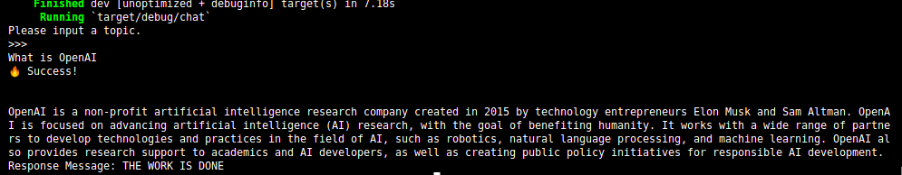

# OpenAI Unofficial Connector Powered BY RUST

This Rust program demonstrates how to connect to OpenAI's Davinci model using the OpenAI API. It allows you to generate text using the powerful language model.

## Prerequisites

Before running the program, ensure that you have the following:

- Rust programming language installed on your system ([https://www.rust-lang.org](https://www.rust-lang.org))
- You must have valid OpenAI API credentials (API key)

## Getting Started

1. Clone this repository to your local machine:


2. Navigate to the project directory:


3. Update the `.env` file with your OpenAI API key or set an evironment variable from your terminal like this:
```sh
OPENAI_KEY="YOUR OPEN AI KEY"
```


4. Build and run the program:

```sh
cargo run
```


## Usage

The program prompts you to enter a text prompt. After entering the prompt, it sends a request to the OpenAI API using your API key and the Davinci model. The response from the API is then displayed on the console.

## Example Usage image:




Feel free to modify the program to suit your needs and experiment with different prompts.

## Contributing

Contributions are welcome! If you have any suggestions, improvements, or bug fixes, please open an issue or submit a pull request.

## License

This program is open-source and released under the [MIT License](https://opensource.org/licenses/MIT).

## Disclaimer

This program is provided as-is without any warranty. Use it at your own risk.

## Contact

For any inquiries or feedback, please contact [ugochukwuchizaram850@gmail.com](mailto:ugochukwuchizaram850@gmail.com)


